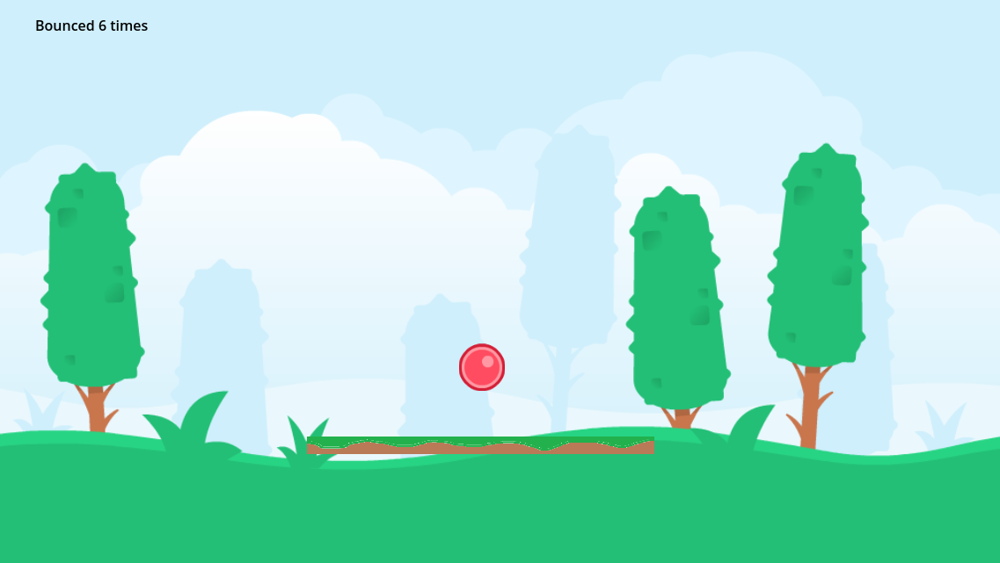
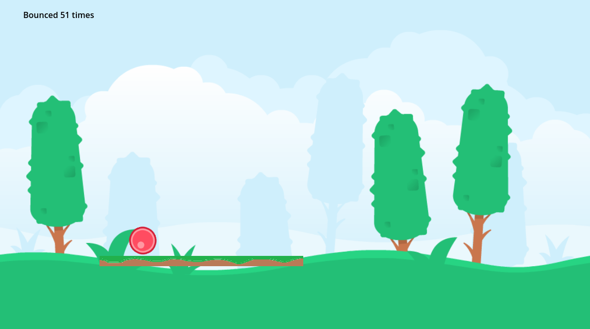
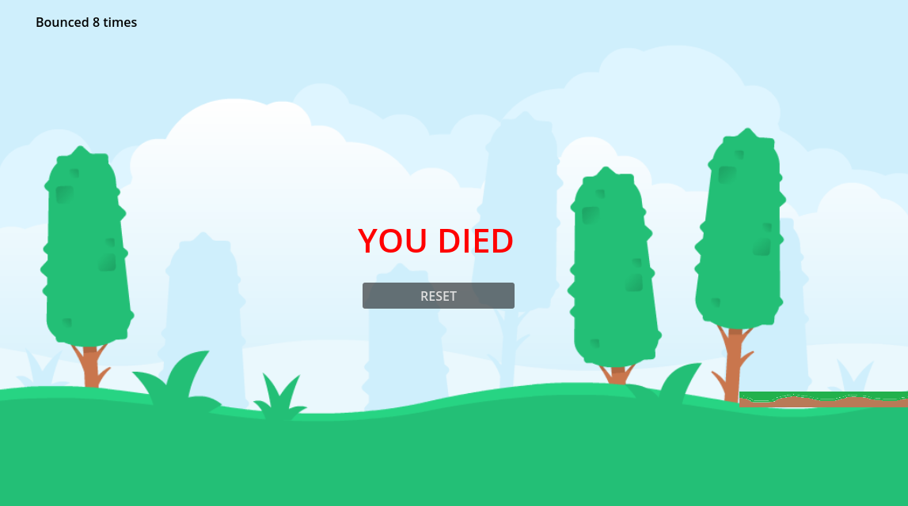

    
    <h1 align="center">Bouncing Ball</h1>
    

## About The Project

  

    Bounce a red ball around in a forest. Bounce counter included, so make try to reach a high score!
    
  

  
  

    Try using the platform to move the ball around to different parts of the stage.
    
  

    But make sure not to drop the ball, or else...
    

## Installation

...

## How It's Made

Engine used: [Godot](https://godotengine.org)  
Assets from: [Kenney.nl](https://www.kenney.nl)

## Future Updates

- Multiple ball colors and stages to choose from.
- Obstacles to increase difficulty.
